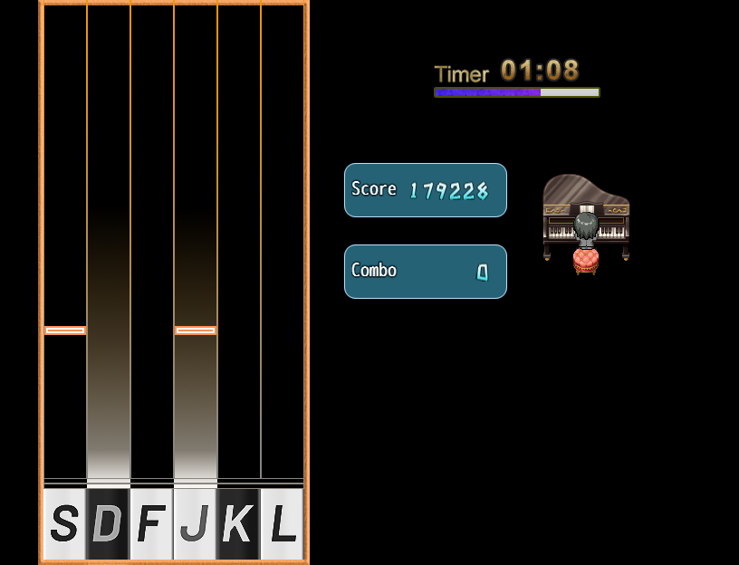

[←返回主页](../welcome/index.md)

　　感谢您愿意浏览我的作品！如有向我反馈《乐之殇》相关问题的需要，欢迎进入[本游戏在Project1论坛的发布页](https://rpg.blue/thread-481935-1-1.html)留言。

# 基本信息

**游戏名：** 乐之殇

**游戏类型：** RPG+音游

**游戏时长：** 约25分钟

**运行平台：** Windows 7+

**版本信息：** 0.1.6 beta 20200612

**游戏介绍：**

　　《乐之殇》是一款角色扮演+6K下落式音乐节奏类游戏。

　　角色扮演方面，画面朴素清新，剧情温馨治愈，氛围还算到位。跟随男孩的视角，看这座音乐城市的一隅。

　　音游方面，目前共有7首钢琴曲，来自几大音乐共享网站，涵盖古典与现代风格。手感说得过去，难度对新手友好。

　　请您下载游戏并开始这二十五分钟的享受吧。

**最新消息：**

　　v0.1.6 已经于 6.12 更新！本次更新依旧在打磨最基本的系统，使游戏功能越来越完整。

　　本次更新的重点是判定的精度有所提高，现在判定频率是每4ms判定一次，准备好兴奋尖叫吧！

　　我对现在的视觉效果和界面很不满。视觉效果很影响打击感；廉价感的界面让人很容易疲劳。我准备继续改进视觉效果和界面，准备好兴奋尖叫吧！

　　v0.1.6 对所有谱面进行了小幅修改，未来剧情中的谱面将长期不变。我将尽力让您舒适地游玩，准备好兴奋尖叫吧！

　　谱面更新后，选曲界面会在成绩过期的曲名右边显示“ot”，意为过时（out of time）。未来会增加更多功能，准备好兴奋尖叫吧！

# 下载地址

[百度网盘](https://pan.baidu.com/s/17PdGwqTjKFH-geGAZncVDQ)（提取码：yzs0）  [腾讯微云](https://share.weiyun.com/uyG7uDoo)

# 额外信息

**温馨提示：**

　　参加活动【衰亡】的版本为 0.1.3 beta 20200530 ，可以在下载链接（仅腾讯微云）的历史版本文件夹中找到。

　　下载不同版本后，替换整个save文件夹可以继承存档。如果已有旧版的游戏本体，可以使用替换文件的方式更新版本。

　　目前所有版本存档通用，但未来的版本不保证存档通用。大版本更新时，可能会失去进度和分数记录。

　　程序有几率卡死，按F5刷新或重启即可。放心，有自动存档。

　　有时会忽然卡一下，可能是js的垃圾回收器在运行。这个问题以作者的技术解决不了，见谅。

　　1号存档保存了分数记录，因此请勿通过删档的方式重置剧情，通关后有重新体验剧情的选项。如果是为了清空分数记录，则删档是正确手段。

　　目前所有谱面均为测试谱面，大版本更新时会作小幅度修改（尽可能不修改）。

　　~~通关后解锁的Normal谱都是半成品，它们的难度甚至不如一些Eazy谱。~~

　　有什么意见或建议欢迎提出，任何方面的都可以！

**制作工具：** RPG Maker MV

**输入设备：** 键盘（QWERTY布局的标准ASCII键盘。如果不是此类键盘，可能需要改映射）

**分辨率：** 816*624

**声音：** 立体声

**色彩：** 真彩色

**内存需求：** 512MB（测试中内存占用峰值约296MB）

**存储空间：** 255MB

# 游戏截图

# 素材来源

## **创作者**

> 开关关  心上秋

## **鸣谢 非原创素材来源**

### 声音

> **RMMV**
>
> https://www.rpgmakerweb.com/

> **Adobe Audition Sound Effects**
>
> https://offers.adobe.com/en/na/audition/offers/audition_dlc/AdobeAuditionDLCSFX.html

> **FreePD**
>
> https://freepd.com/

> **HURT RECORD**
>
> https://www.hurtrecord.com/

> **魔王魂**
>
> https://maoudamashii.jokersounds.com/

> **ポケットサウンド**
>
> https://pocket-se.info/

### 图像

> **RMMV  RMVA**
>
> https://www.rpgmakerweb.com/

### 插件

> **作者：RM CoreScript team**
>
> https://www.rpgmakerweb.com/

> **作者：Moghunter**
>
> https://atelierrgss.wordpress.com/

> **作者：Drill_up**
>
> https://rpg.blue/thread-409713-1-2.html

> **作者：芯☆淡茹水**
>
> https://rpg.blue/thread-480181-1-1.html

> **作者：triacontane**
>
> https://github.com/triacontane/RPGMakerMV/blob/master/MessageWindowPopup.js

> **作者：魏玉龙**
>
> https://rpg.blue/thread-410179-1-1.html

# 更新日志

> ###### 0.1.6 beta 20200612
>
> 修改了全部谱面（都是小幅调整，比如BGM的延迟什么的）。
> 增加了结算界面显示曲名和本次成绩与最高成绩差值的功能。

> ###### 0.1.5 beta 20200611 有bug，已下架。
>
> 修复了音符击打效果动画会移动的bug。
> 修改了判定机制，提高了击打判定的精度和运行效率。
> 修改了Priere (Eazy)、Priere (Normal)、Erize (Eazy)、悲しみのモノクロ (Eazy)、宵闇月の鼓動 (Eazy)的谱面（小幅调整以适应新机制，以往成绩暂时不作废）。
> 增加了成绩替换模式（设置中打开后，可以强制用最新成绩替换以往最高成绩。因为谱面有变化，一些数值可能会出错，用此法以新换旧即可解决）。

> ###### 0.1.4 beta 20200610
>
> 修复了两个“按下”音符挨得太近时，按一次同时击打两个的bug。
> 增加了按住按键的视觉效果。

> ###### 0.1.3 beta 20200530
>
> 修复了练习选曲列表不显示AC的bug。（更新后需要打一次才显示AC或FC。）

> ###### 0.1.2 beta 20200529
>
> 修复了序幕家门口可以通行的bug。（关上了墙世界的大门。）
> 增加了练习选曲列表显示FC、AC两种成就的功能。（刚更新不会显示FC，打一次就有了。）

> ###### 0.1.1 beta 20200527
>
> 修复了通关后回顾剧情不运行自动事件的bug。
> 修复了从未练习过的曲子读取最高分报错的bug。
> 修复了通关后练习结束不淡入画面的bug。

> ###### 0.1.0 beta 20200526
>
> 发布了游戏本体。
